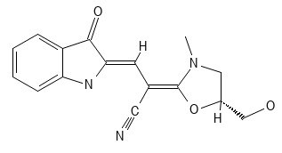
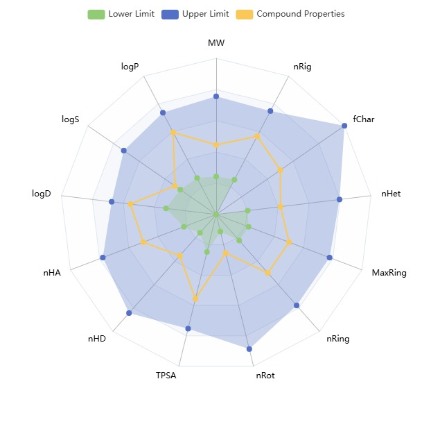

# GRS (Граник)

---
{: width=50% style="display: block; margin: auto;} 
<p style="text-align: center;">GSR</p>

---
 Антитромботический лекарственный препарат (малая молекула) нового поколения, сочетающий антитромботический, антигипертензивный эффект и способность устранять эндотелиальную дисфункцию – основу сердечно-сосудистой патологии


---
## Мишень и сайты связывания

Исследованые структуры не найдены.


---
## Механизм действия 

Является стимулятором растворимой гуанилатциклазы (рГЦ) – активирует сигнальный путь NO-рГЦ-цГМФ, который играет важнейшую роль в регуляции сердечно-сосудистой системы, включая состояние эндотелия сосудов, сосудистого тонуса, агрегацию тромбоцитов и тромборезистентность сосудистой стенки.

---

# Рабочие заметки

Далее будут выполнены поэтапные записи о ходе работы связанные с этим веществом.

---
---
## Этап 1. admetlab3.scbdd.com

---
### R-Изомер

{:style="display: block; margin: auto;} 
<p style="text-align: center;">Радар-диаграмма биоактивности. Показатели вещества входят в зону биоактивности</p>

**Общее описание**

Согласно показателю QED данное вещество попадает в категорию unatractive.

По ряду правил (Липински, Файзер, ГСК, "Золотой треугольник") классифицируем данное вещество как биологически активное. Предупреждения PAINS отсутствуют.

**ABSPORPTION**

```
Caco-2 Permeability	-5.282		
MDCK Permeability	-4.917		
PAMPA	+		
Pgp inhibitor	+++		
Pgp substrate	---		
HIA	--		
F20%	---		
F30%	++		
F50%	+++		
```

Предполоагается затрудненное всасывание через кишечную стенку согласно моделям Caco-2 и MDCK.

Есть вероятность переноса Pgp, также как и его ингибирования. Адсорбируется в ЖКТ.

Вероятнее всего в системный кровоток попадет около 20% препарата.

**DISTRIBUTION**

```
PPB	95.4%		
VDss	0.059		
BBB	---		
Fu	4.8%		
OATP1B1 inhibitor	+++		
OATP1B3 inhibitor	++		
BCRP inhibitor	---		
MRP1 inhibitor	--		
BSEP inhibitor	+++
```
*Значительная вероятность связывания с белками плазмы крови!*

Объем распределения входит в оптимальный диапазон. Через гематоэнцефалический барьер не проходит.

Есть вероятность ингибирования OATP1B1 и OATP1B3 транспортеров. 

**METABOLISM**

```
CYP1A2 inhibitor	+++		
CYP1A2 substrate	+++		
CYP2C19 inhibitor	---		
CYP2C19 substrate	---		
CYP2C9 inhibitor	---		
CYP2C9 substrate	---		
CYP2D6 inhibitor	--		
CYP2D6 substrate	---		
CYP3A4 inhibitor	-		
CYP3A4 substrate	---		
CYP2B6 inhibitor	---		
CYP2B6 substrate	---		
CYP2C8 inhibitor	---		
HLM Stability	+		
```

Указана значительная вероятность взаимодействия с цитохромом CYP1A2. 


**EXCRETION**

```
CLplasma	4.956		ml/min/kg
T1/2	        1.025           hour
```

Клиренс низкий, время полувыведения - около часа.

**TOXICITY**