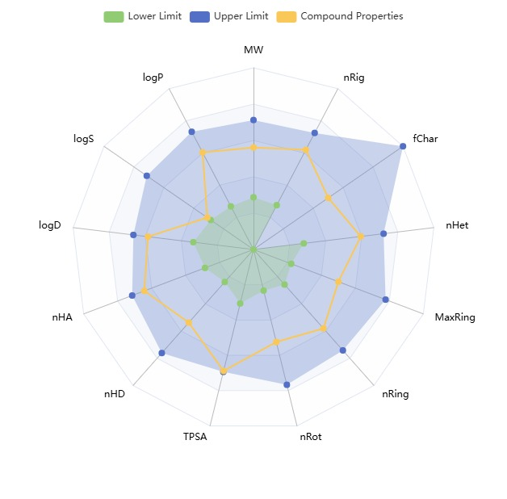

[Вернуться на главную страницу](../result.md)

# GRS (Граник)

---
{: width=50% style="display: block; margin: auto;} 
<p style="text-align: center;">S-GRS</p>

---
 Антитромботический лекарственный препарат (малая молекула) нового поколения, сочетающий антитромботический, антигипертензивный эффект и способность устранять эндотелиальную дисфункцию – основу сердечно-сосудистой патологии


---
## Мишень и сайты связывания

Исследованые структуры не найдены.


---
## Механизм действия 

Является стимулятором растворимой гуанилатциклазы (рГЦ) – активирует сигнальный путь NO-рГЦ-цГМФ, который играет важнейшую роль в регуляции сердечно-сосудистой системы, включая состояние эндотелия сосудов, сосудистого тонуса, агрегацию тромбоцитов и тромборезистентность сосудистой стенки.

---

# Рабочие заметки

Далее будут выполнены поэтапные записи о ходе работы связанные с этим веществом.

---
---
## Этап 1. admetlab3.scbdd.com

---
### S-Изомер

{:style="display: block; margin: auto;} 
<p style="text-align: center;">Радар-диаграмма биоактивности. Показатели вещества входят в зону биоактивности</p>

**Общее описание**

Согласно показателю QED данное вещество попадает в категорию unatractive.

По ряду правил (Липински, Файзер, ГСК, "Золотой треугольник") классифицируем данное вещество как биологически активное. Предупреждения PAINS отсутствуют.

**ABSPORPTION**

```
Caco-2 Permeability	-5.282		
MDCK Permeability	-4.917		
PAMPA	+		
Pgp inhibitor	+++		
Pgp substrate	---		
HIA	--		
F20%	---		
F30%	++		
F50%	+++		
```

Предполоагается затрудненное всасывание через кишечную стенку согласно моделям Caco-2 и MDCK.

Вероятнее всего Pgp не переносится, а также ингибирует действие. Адсорбируется в ЖКТ.

Вероятнее всего в системный кровоток попадет около 20% препарата.

**DISTRIBUTION**

```
PPB	95.4%		
VDss	0.059		
BBB	---		
Fu	4.8%		
OATP1B1 inhibitor	+++		
OATP1B3 inhibitor	++		
BCRP inhibitor	---		
MRP1 inhibitor	--		
BSEP inhibitor	+++
```
*Значительная вероятность связывания с белками плазмы крови!*

Объем распределения входит в оптимальный диапазон. Через гематоэнцефалический барьер не проходит.

Есть вероятность ингибирования OATP1B1 и OATP1B3 транспортеров. 

**METABOLISM**

```
CYP1A2 inhibitor	+++		
CYP1A2 substrate	+++		
CYP2C19 inhibitor	---		
CYP2C19 substrate	---		
CYP2C9 inhibitor	---		
CYP2C9 substrate	---		
CYP2D6 inhibitor	--		
CYP2D6 substrate	---		
CYP3A4 inhibitor	-		
CYP3A4 substrate	---		
CYP2B6 inhibitor	---		
CYP2B6 substrate	---		
CYP2C8 inhibitor	---		
HLM Stability	+		
```

Указана значительная вероятность взаимодействия с цитохромом CYP1A2. 


**EXCRETION**

```
CLplasma	4.956		ml/min/kg
T1/2	        1.025           hour
```

Клиренс низкий, время полувыведения - около часа.

**TOXICITY**

```
hERG Blockers	0.051		
hERG Blockers (10um)	0.191		
DILI	0.981		
AMES Toxicity	0.953		
Rat Oral Acute Toxicity	0.425		
FDAMDD	0.345		
Skin Sensitization	0.996		
Carcinogenicity	0.887		
Eye Corrosion	0.009		
Eye Irritation	0.863		
Respiratory	0.449		
Human Hepatotoxicity	0.87		
Drug-induced Nephrotoxicity	0.958		
Drug-induced Neurotoxicity	0.93		
Ototoxicity	0.646		
Hematotoxicity	0.664		
Genotoxicity	0.993		
RPMI-8226 Immunitoxicity	0.095		
A549 Cytotoxicity	0.312		
Hek293 Cytotoxicity	0.39		
BCF	0.407		
IGC50	3.012		
LC50DM	4.415		
LC50FM	3.593		
                                   TOX21 PATHWAY
NR-AhR	+++		
NR-AR	--		
NR-AR-LBD	---		
NR-Aromatase	++		
NR-ER	--		
NR-ER-LBD	---		
NR-PPAR-gamma	---		
SR-ARE	+++		
SR-ATAD5	-		
SR-HSE	+		
SR-MMP	+++		
SR-p53	++
```

Предсказана гепатотоксичность, сенсебилизация кожи, ирритация глаз, нефротоксичность, генотоксичность.

Для прояснения картины в первую очередь следует изучить влияние на сигнальные пути:

1. NR-AhR
2. SR-ARE
3. SR-MMP


>Промежуточный вывод: Общая картина анализа ADMET для данной конформации схожа с препаратами аналогами. Предсказаны несколько вариантов токсичности. Требуются уточнения другими методами.


### R-Изомер

{:style="display: block; margin: auto;} 
<p style="text-align: center;">Радар-диаграмма биоактивности. Показатели вещества входят в зону биоактивности</p>

**Общее описание**

Согласно показателю QED данное вещество попадает в категорию unatractive, хотя близко к нижней границе atractive.

По ряду правил (Липински, Файзер, ГСК, "Золотой треугольник") классифицируем данное вещество как биологически активное. Предупреждения PAINS отсутствуют.

**ABSPORPTION**

```
Caco-2 Permeability	-5.424		
MDCK Permeability	0.0		
PAMPA	+++		
Pgp inhibitor	++		
Pgp substrate	---		
HIA	---		
F20%	---		
F30%	-		
F50%	++	
```

Предполоагается затрудненное всасывание через кишечную стенку согласно модели Caco-2.

Согласно модели MDCK всасывание невозможно.

Вероятнее всего Pgp не переносится, а также ингибирует действие. Адсорбируется в ЖКТ.
Вероятность ингибирования меньше чем у другого изомера.

Вероятнее всего в системный кровоток попадет около 20-30% препарата.

**DISTRIBUTION**

```
PPB	85.9%		
VDss	1.289		
BBB	---		
Fu	9.6%		
OATP1B1 inhibitor	+++		
OATP1B3 inhibitor	+++		
BCRP inhibitor	---		
MRP1 inhibitor	--		
BSEP inhibitor	+++
```
*Значительная вероятность связывания с белками плазмы крови! Но меньше чем у другого изомера*

Объем распределения входит в оптимальный диапазон. Через гематоэнцефалический барьер не проходит.

Предполагаемая доля свободных моллекул в плазме крови выше в 2 раза.

Есть вероятность ингибирования OATP1B1 и OATP1B3 транспортеров. 

**METABOLISM**

```
CYP1A2 inhibitor	+++		
CYP1A2 substrate	+++		
CYP2C19 inhibitor	---		
CYP2C19 substrate	---		
CYP2C9 inhibitor	---		
CYP2C9 substrate	---		
CYP2D6 inhibitor	--		
CYP2D6 substrate	---		
CYP3A4 inhibitor	--		
CYP3A4 substrate	---		
CYP2B6 inhibitor	---		
CYP2B6 substrate	---		
CYP2C8 inhibitor	--		
HLM Stability	--			
```

Указана значительная вероятность взаимодействия с цитохромом CYP1A2. Микросомальная стабильность ниже чем у изомера. 


**EXCRETION**

```
CLplasma	4.572		ml/min/kg
T1/2	0.963           hour
```

Клиренс низкий, время полувыведения - около часа.

**TOXICITY**

```
hERG Blockers	0.048		
hERG Blockers (10um)	0.258		
DILI	0.9		
AMES Toxicity	0.841		
Rat Oral Acute Toxicity	0.307		
FDAMDD	0.156		
Skin Sensitization	0.977		
Carcinogenicity	0.648		
Eye Corrosion	0.009		
Eye Irritation	0.788		
Respiratory	0.139		
Human Hepatotoxicity	0.883		
Drug-induced Nephrotoxicity	0.804		
Drug-induced Neurotoxicity	0.7		
Ototoxicity	0.647		
Hematotoxicity	0.529		
Genotoxicity	0.966		
RPMI-8226 Immunitoxicity	0.058		
A549 Cytotoxicity	0.169		
Hek293 Cytotoxicity	0.258		
BCF	0.441		
IGC50	3.036		
LC50DM	4.444		
LC50FM	3.676		
                                  TOX21 PATHWAY
NR-AhR	+++		
NR-AR	---		
NR-AR-LBD	---		
NR-Aromatase	++		
NR-ER	---		
NR-ER-LBD	---		
NR-PPAR-gamma	---		
SR-ARE	+++		
SR-ATAD5	--		
SR-HSE	+		
SR-MMP	+++		
SR-p53	++
```

Предсказана гепатотоксичность, сенсебилизация кожи, ирритация глаз, нефротоксичность, генотоксичность.

Для прояснения картины в первую очередь следует изучить влияние на сигнальные пути:

1. NR-AhR
2. SR-ARE
3. SR-MMP
---
