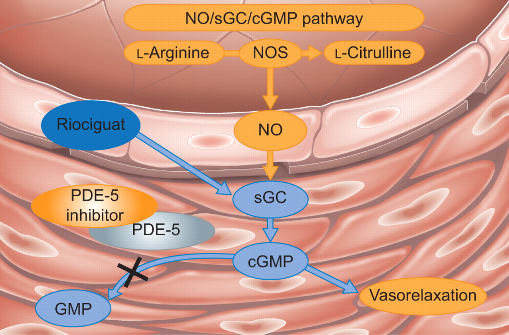

[Вернуться на главную страницу](../result.md)

# Верицигуат (Vericiguat)

---
{: width=50% style="display: block; margin: auto;} 

Верицигуат

---
Верицигуат, продаваемый под торговой маркой Verquvo, является лекарством, используемым для снижения риска сердечно-сосудистой смерти и госпитализации у некоторых пациентов с сердечной недостаточностью после недавнего события острой декомпенсации. Его принимают внутрь. Верицигуат является стимулятором растворимой гуанилатциклазы (sGC)

Препарат вызывает подавление рефлекса Китаева.

Распространенные побочные эффекты включают низкое кровяное давление и низкое количество эритроцитов (анемия).

Согласно данным go.drugbunk.com верицигуат является прямым стимулятором гладкомышечной ткани.

---
## Мишень и сайты связывания

Исследованые структуры не найдены.

---
## Механизм действия 

Аналогичен риоцигуату

{: width=50% style="display: block; margin: auto;} 

Схема действия риоцигуата на мышечную ткань сосудов

---

# Рабочие заметки

Далее будут выполнены поэтапные записи о ходе работы связанные с этим веществом.

---

---
## Этап 1. admetlab3.scbdd.com

