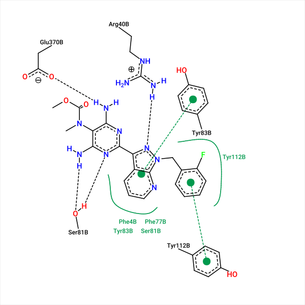
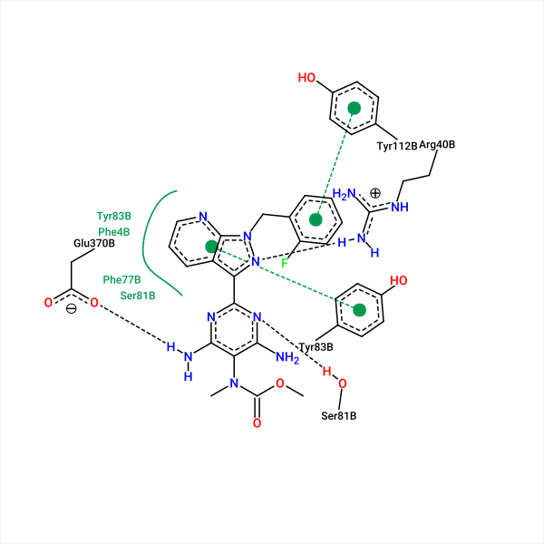

# Исследование биологической активности GRS

В данном файле описанно предварительньное исследование биологической активности методами вычислительной химии

---

## План работы

- [x] Общее описание исследуемых веществ
- [x] Сбор известной информации
- [x] ADMET Анализ
- [ ] Моллекулярный докинг и сравнение афинностей
- [ ] Анализ связывания с альбумином. Моделирование накопления и вывода
- [ ] Моллекулярная динамика веществ.
- [ ] Анализ активности метаболитов
- [-] Нейросетевой анализ токсичности. Подтверждение докингом
- [x] Фармакофорный поиск
- [ ] Вывод и заключение

---

## Исследуемые вещества

1. [GRS](./compounds-res/GRS.md)
2. [Riociguat](./compounds-res/Riociguat.md)
3. [Vericiguat](./compounds-res/Vericiguat.md)

Для каждого вещества есть отдельная страница отчета.

---

# Анализ ADMET

 > Для данного этапа используются следующие программы
    1. [admetlab3.scbdd.com](https://admetlab3.scbdd.com/)
    2. swissadme.ch

Для анализа на данном этапе входным форматом является SMILES. Соответственно для учета хиральности выделены **R и S изомеры**.

|        |                          S-GRS                         |                         R-GRS                         |                          GRS                         |                      Riociguat                      |                          Vericiguat                          |
|--------|--------------------------------------------------------|-------------------------------------------------------|------------------------------------------------------|-----------------------------------------------------|--------------------------------------------------------------|
| SMILES | OC[C@@H]1O\C(N(C1)C)=C(\C([H])=C3/NC2=CC=CC=C2C3=O)C#N | OC[C@H]1O\C(N(C1)C)=C(\C([H])=C3/NC2=CC=CC=C2C3=O)C#N | OC[CH]1O\C(N(C1)C)=C(\C([H])=C3/NC2=CC=CC=C2C3=O)C#N | c14ncccc4c(-c(nc2N)nc(N)c2N(C)C(=O)OC)nn1Cc3ccccc3F | COC(=O)NC1=C(N=C(N=C1N)C2=NN(C3=C2C=C(C=N3)F)CC4=CC=CC=C4F)N |

Табл.1 SMILES исследуемых веществ.
---
## Этап 1. admetlab3.scbdd.com

Существует два варианта использования предложенного интерфейса: програмно через API или через Web-интерфейс. Поскольку набор веществ позволяет ручную обработку, был использован веб интерфейс. Полный набор значений приведен в файле [admet-1.csv](./admet-1.csv). На странице каждого вещества приведены подробные таблицы.

### Вывод: 

> R изомер более перспективен по ряду параметров. Ярко выделяется разница в связывании с белками плазмы крови.

## Этап 2. Фармакофорный поиск через PharmMapper

С списком потенциальных мишений взаимодействия можно ознакомиться далее:

[S-GRS](./compounds-res/s-PM%20-%20Result.html)
[R-GRS](./compounds-res/r-PM%20-%20Result.html)

### Вывод: 

> Получен ряд потенциальных мишений взаимодействия. Лучшие совпадения с фармакофорами в базе - около 70%.

## Этап 3. Моллекулярный докинг

Необходимо выполнить моллекулярный докинг ряда веществ на предложенные мишени, и предположить потенциальную эффективность соединения GRS относительно аналогов.

Согласно предварительно собраной информации необходимо исследовать взаимодействие предложенных веществ с следующими мишенями:
1. Растворимая гуанилциклаза
2. Мембраносвязаная гуанилциклаза
3. Эднотелиальная синтаза оксида азота
4. Фосфатидил эстеразы II, III и V

Докинг для мишеней будтет выполняться в карман связывания специфичный исследуемому лиганду.

### Растворимая гуанилциклаза

Является основной мишенью Риоцигуата. 

> Для докинга выбрана структура **8HBF**, так как содержит один из целевых лигандов, и имеет наилучшее разрешение из предложенных.

Карман связывания выбран по лиганду Риацигуат. 

Параметры кармана:

|135 |142| 123|
|-|-|-|
|20| 20| 20|

|  Параметр |  S-GRS |  R-GRS | Riociguat | Vericiguat |
|-----------|--------|--------|-----------|------------|
| Афинность кКал/моль| -5.866 | -7.933 |  -10.774  |  -10.655   |
|    Ссылка |[Ссылка](https://www.swissdock.ch/results.php?job=93118950)|[Ссылка](https://www.swissdock.ch/results.php?job=74379929)|[Ссылка](https://www.swissdock.ch/results.php?job=16625594)|[Ссылка](https://www.swissdock.ch/results.php?job=50278085)|

Табл.2 Афинности лучшего расположения исследуемых веществ, а также ссылки на результаты докинга в SwissDock

---

## Контроль

Для контроля работы инструмента сделана визуализация предсказанного связывания с известным лигандом

{:style="display: block; margin: auto;}

Визуализация кармана связывания в исследованной структуре

{:style="display: block; margin: auto;} 

Визуализация связывания в предсказанной структуре

> Предсказанные аминокислоты соответствуют исследованной структуре. 